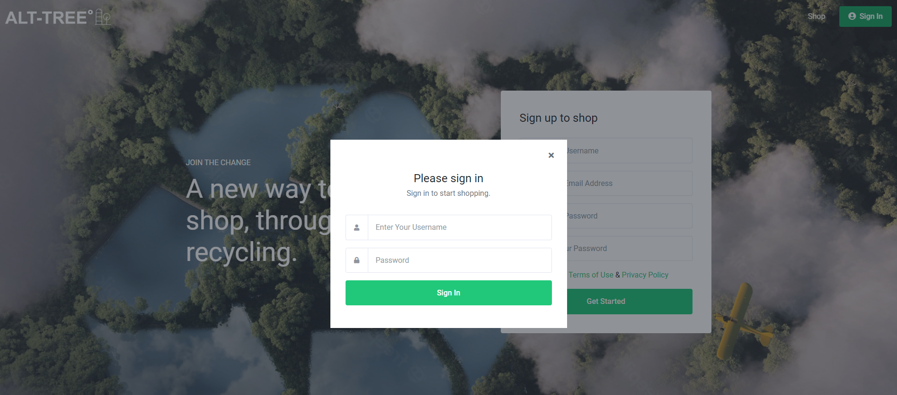
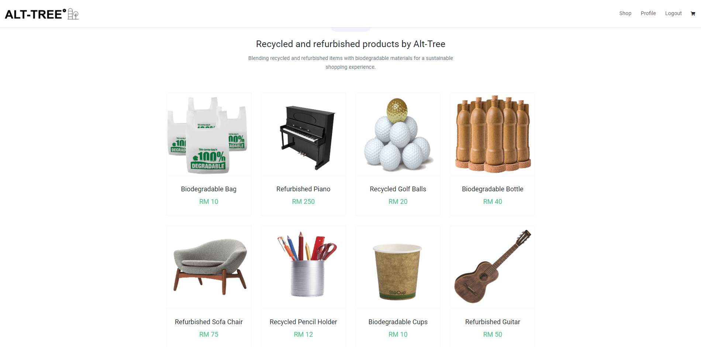
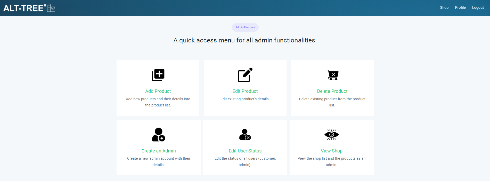

# Alt-Tree E-Commerce Website:deciduous-tree:	
Alt-Tree is a fully responsive e-commerce website designed for selling recycled and refurbished items. The project focuses on front-end development using HTML, CSS (with Bootstrap 4), and JavaScript.
It is built with PHP for server-side scripting, while the database is managed with phpMyAdmin and SQL. 

## Table of Contents :scroll:
- [Features](#features-star)
- [Installation](#installation-hammer_and_wrench)
- [Usage](#usage-keyboardcomputer_mouse)
- [FAQ](#faq-question)

## Features :star:
- Browse for recycled and refurbished items
- User authentication for accounts
- Admin panel for managing items and users
- Responsive design with Bootstrap 4

## Installation :hammer_and_wrench:
### Prerequisites
- XAMPP: Version 8.0.9+ ([includes PHP, MySQL, and phpMyAdmin](https://www.apachefriends.org/))
- PHP: Version 7.4+ (included with XAMPP)
- MySQL: Version 5.7+ (included with XAMPP)

### Steps
1. **Clone the repository**:
    ```bash
    git clone https://github.com/amadzai/alt-tree-ecommerce.git
    ```

   *or, if using SSH:*
    ```bash
    git clone git@github.com:amadzai/alt-tree-ecommerce.git
    ```

2. **Navigate to the project directory**:
    ```bash
    cd alt-tree-ecommerce
    ```

3. **Set up the database**:
- Run XAMPP, then start the Apache and MySQL services.
- Open [phpMyAdmin](http://localhost/phpmyadmin/).
- Create a new database named `alt-tree`.
- Select the newly created database, and import the provided SQL file `alt_tree.sql` into this database.

4. **Run the project**:
- Place the project folder (`alt-tree-ecommerce`) into the `htdocs` directory of your XAMPP installation folder.
- Open a browser and navigate to the [index page](http://localhost/alt-tree-ecommerce/index.php) to view the project.

## Usage :keyboard::computer_mouse:
1. After setting up and navigating to the index page, you can log in using the following credentials:

    **Admin Account:**
    - **Username:** admin
    - **Password:** AltTree@1234

    **User Account:**
    - **Username:** tomasBuit
    - **Password:** AltTree@1234



From the index page, you can also create new user accounts. However, new accounts will default to regular user roles. To grant admin privileges to a new account, log in with the existing admin account and adjust user roles as needed.

2. For users, after logging in, navigate to the Shop page to view the pre-populated Alt-Tree products:



3. For admins, after logging in, you will be greeted with the panel containing all the admin functionalities:



4. There are many more pages, feel free to explore and mess around with Alt-Tree!

## FAQ :question:
1. Why can't I add anything to the shopping cart?
- As this is a front-end focused project, the shopping cart and checkout functionality has not been added yet. Will be looking to add this in the future!

2. When pressing the `Edit Profile` button, it does not redirect me to the page.
- This is a known issue that is still being fixed. You will need to spam-click the button for it to redirect to the Edit Profile page.